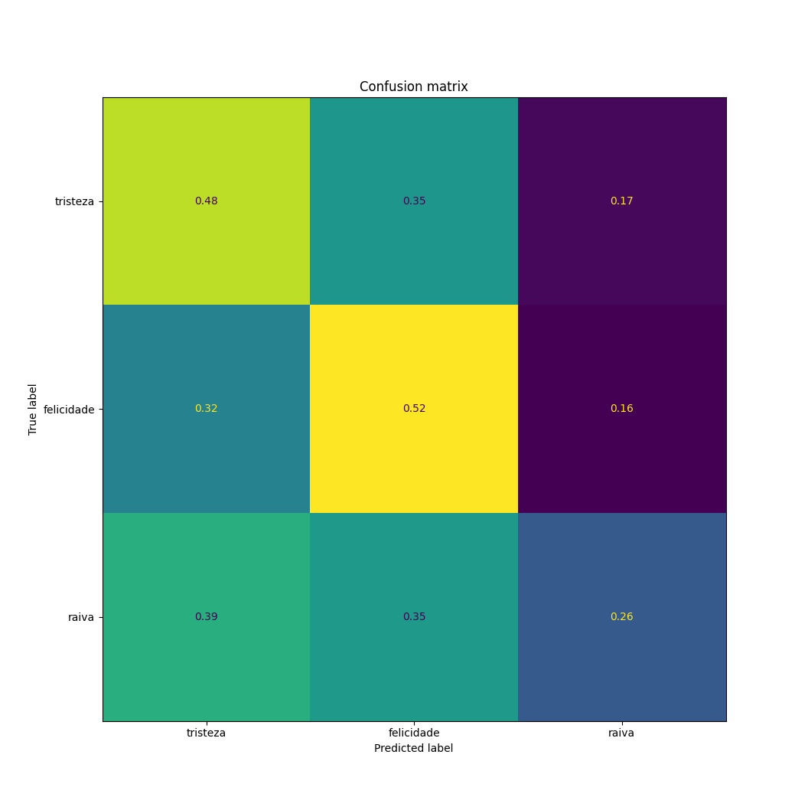

# Análise de Sentimento
Análise de sentimento, para classificar se uma frase representa felicidade, tristeza ou raiva.

Utilizando frameworks de PNL é possível realizar Análise de Sentimento para determinar se uma frase é positiva, neutra ou negativa. No entanto, para classificar a emoção da frase, esta abordagem não é suficiente.
Para tal objetivo é necessário utilizar uma abordagem com um algoritmo para classificar as frases de entrada.
O dataset utilizado para treinar o algoritmo foi o [Twitter Emotion Classification](https://www.kaggle.com/code/shtrausslearning/twitter-emotion-classification/notebook), com vários tweets em inglês classificados como (tristeza, alegria, amor, raiva, medo, surpresa).

O pipeline definido para o projeto segue:
1. **Pré-processar o DataSet**: Remover tweets com emoções não desejadas ou valores nulos e traduzir o texto para português utilizando [deep-translator](https://deep-translator.readthedocs.io/en/latest/index.html);
2. **Definição de Modelo**: Definição do modelo que será utilizado;
3. **Treinamento do Modelo**: Treinamento utilizando o DataSet em português;
4. **Validação do Modelo**: Validação se o modelo alcança o objetivo proposto

## Discussão
Primeiramente, o modelo utilzado foi um SVC.
Com o modelo definido, o mesmo foi treinado e avaliado, sendo criada a seguinte matriz de confusão:

E os seguintes exemplos com frases de entrada:
|Entrada                              |Sentimento Esperado| Sentimento Obtido|
|---|---|---|
|Sinto sua falta                      |Tristeza|Tristeza|
|Não quero saber de nada, eu te odeio!|Raiva|Tristeza|
|Estou contente                       |Felicidade|Felicidade|
|gosto de você                        |Felicidade|Felicidade|
|eu não gosto disso                   |Raiva|Felicidade|
|te adoro                             |Felicidade|Felicidade|
|isso é muito chato                   |Tristeza|Tristeza|
|te odeio!                            |Raiva|Felicidade|

A matriz de confusão apresentou valores aceitáveis de acurácia, no entanto algumas das frases de entrada tiveram resultados diferentes do esperado. Ao analisar o dataset, é possível encontrar algumas classificações que podem causar confusões, como:

|Frase|Sentimento|
|---|---|
|Eu odeio me sentir assim, isso é besteira, ok, estou farto, tchau|Felicidade|
|tenho a sensação de que vou ficar sem coração|Raiva|
|não me sinto tão feliz como antes|Felicidade|

Por isso, para poder melhor validar os resultados, um DataSet diferente se faz interessante. No entanto, não há uma disponibilidade ampla de tais DataSets. Então um DataSet foi [confeccionado](data/prompt_generated.csv) utilizando prompts de IA.

Também foi feita uma matriz de confusão, comparando com os sentimentos esperados do primeiro DataSet.

Já as frases de entrada de exemplo resultaram em:
|Entrada                              |Sentimento Esperado| Sentimento Obtido|
|---|---|---|
|Sinto sua falta                      |Tristeza|Tristeza|
|Não quero saber de nada, eu te odeio!|Raiva|Raiva|
|Estou contente                       |Felicidade|Felicidade|
|gosto de você                        |Felicidade|Raiva|
|eu não gosto disso                   |Raiva|Raiva|
|te adoro                             |Felicidade|Felicidade|
|isso é muito chato                   |Tristeza|Raiva|
|te odeio!                            |Raiva|Raiva|

Para estas poucas frases de exemplo, o novo modelo teve menos erros, porém com muita margem de melhora, principalmente por utilzar um DataSet com poucos dados (menos que 2% do [Twitter Emotion Classification](https://www.kaggle.com/code/shtrausslearning/twitter-emotion-classification/notebook), mesmo após o pré-processamento).

## Como executar o código
1. Criar um ambiente virtual: `python -m venv venv`
2. Ativar o ambiente virtual: `venv\Scripts\activate.bat` (No Windows)
3. Instalar as bibliotecas: `pip install -r requirements.txt`
4. Executar o arquivo [main](main.py): `python main.py`